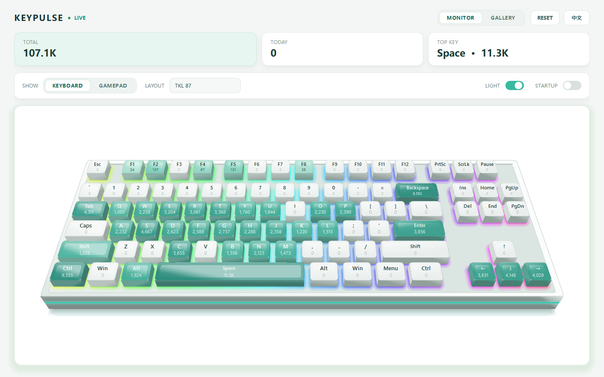
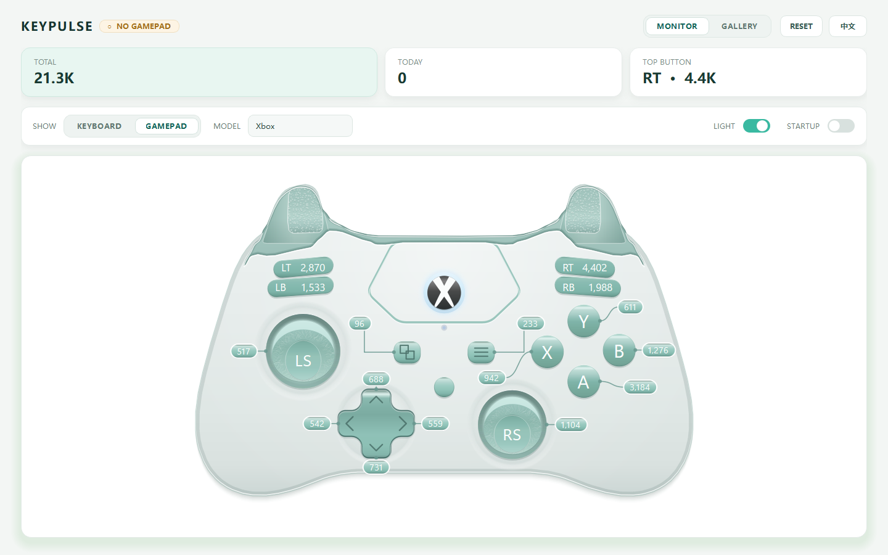

# KeyPulse

[English](README.md) · **简体中文**

Windows 上的立体键盘与手柄热力图。统计你每个按键、每个手柄键按了多少次，把次数
画在渲染出来的键盘上；每次重置前，这一轮会被自动存进画廊。





---

## 隐私 —— 请先看这一节

KeyPulse 装的是 Windows 低级键盘钩子，和键盘记录器用的是同一个机制。所以这件事必须
说清楚，而且代码短到你可以自己核对。

**它只存"每个键一个数字"。** `SPACE: 11329`，记录到此为止。

* **不记录按键顺序**，因此从它的文件里还原不出任何你打过的文字、密码或消息。
  对照 [`hook.py`](hook.py)：回调把虚拟键码映射成一个名字，然后调用
  `on_press(key_id)`；这个名字在 [`storage.py`](storage.py) 里当字典的键，把它后面
  的计数器加一。没有往任何列表里追加，也不为单次按键记时间戳。
* **不记录当前窗口或前台程序是什么。**
* **完全没有联网代码。** 没有遥测、没有更新检查、没有统计上报、没有账号。
  `grep -rE "urllib|requests|socket|http" *.py` 结果为空。除非你自己拷走，数据不会
  离开这台机器。
* 所有写下来的东西都是程序旁边可读的纯 JSON，你随时能打开看清楚里面有什么。

杀毒软件仍可能因为"装了键盘钩子"这一条报警，Windows SmartScreen 也会因为程序未签名
而拦一下。这是预期之内的，见[运行](#运行)。

## 它能做什么

* **两台设备同时统计。** 键盘和手柄各记各的，切到哪一面看都不影响另一面继续统计。
* **四种键盘配列** —— 全尺寸 104 键、TKL、75%、60% —— 按透视角度立体呈现，靠近自己
  的键更大，会露出侧面。
* **四种手柄外形** —— Xbox、DualSense、Switch Pro，以及一只普通有线 XInput 手柄，
  各自的按键排布都不一样。
* **每个键帽一种热力配色**，次数直接印在键帽上，哪个键用得多一眼就看得出来。
* **可选 RGB 灯光**，照着轴下背光做：彩虹光波从键帽缝隙里透出来，每敲一下那颗键白光
  爆闪一次。默认关闭；关掉或缩到托盘后完全停止重绘，不占 CPU。
* **画廊。** 每次重置都会把这一轮存成一张键盘的 `.png` 加一份计数的 `.json`，挂在
  一面可以浏览、点开、删除的墙上。
* **中英双语**，顶栏一键切换。两种语言下数据文件里记的始终是英文。
* **托盘常驻与开机自启。** 关窗口后缩到托盘继续统计。

## 运行

### 用发布版

从 [Releases](../../releases) 下载 `KeyPulse_vX.Y.Z_Windows_x64.zip`，解压后双击
`KeyPulse.exe`，无需安装。

程序未做代码签名，首次运行 Windows SmartScreen 会弹出蓝色的"Windows 已保护你的电脑"。
确认来源可信后选 **更多信息 → 仍要运行**。不放心的话，自己按下面的步骤编译一份。

### 从源码运行

需要 Windows 上的 Python 3.11+。

```powershell
pip install -r requirements.txt
python main.py
```

可用参数：

| 参数 | 作用 |
| --- | --- |
| `--demo` | 给两台设备填上一批合理的假数据，用来截图 |
| `--no-hook` | 只开窗口，不装键盘钩子 |
| `--background` | 启动后直接缩到托盘 |
| `--screenshot PATH` | 把窗口渲染成 PNG 后退出 |
| `--device keyboard\|gamepad` | `--screenshot` 抓哪一台设备 |

## 编译

```powershell
powershell -ExecutionPolicy Bypass -File .\build.ps1
```

`build.ps1` 会检查环境、跑完整套测试、用 PyInstaller 打出单文件 exe，然后生成
`release/KeyPulse_vX.Y.Z_Windows_x64.zip`（exe 加许可证、第三方声明和使用说明）。
CI 里加 `-NoPause`，想换输出目录加 `-OutDir`，想把新 exe 直接装到你日常运行的那个
文件夹加 `-InstallTo <路径>`。版本号写在 `build.ps1` 里，必须和 `version_info.txt`
一致，否则脚本第一步就会拒绝编译。

## 数据存在哪

存在程序旁边 —— `KeyPulse.exe` 和它的文件放在一起，所以复制一份就带着自己那份计数，
删掉文件夹就全删干净。

```
stats.json      两台设备的实时计数
settings.json   配列、缩放、语言、灯光、托盘行为
snapshots/
  keyboard/     键盘每份存档的 .png + .json
  gamepad/      手柄的同上
```

如果程序被放在写不进去的地方（Program Files、只读共享盘），会退回到
`%LOCALAPPDATA%\KeyPulse`。

完整的功能说明见 [docs/USER_GUIDE.zh-CN.txt](docs/USER_GUIDE.zh-CN.txt)。

## 测试

99 个测试，除了 Qt 的离屏平台外不需要显示器。

```powershell
$env:PYTHONPATH = $PWD
python tests\test_core.py
python tests\test_lighting.py
python tests\test_gallery.py
python tests\test_i18n.py
```

## 代码结构

| 文件 | 负责什么 |
| --- | --- |
| `main.py` | 启动、命令行参数、单实例锁、把钩子接到窗口上 |
| `ui.py` | 主窗口、顶栏、托盘、重置流程、存档图渲染 |
| `render.py` | 立体键盘画布和它的灯光 |
| `layouts.py` | 四种键盘配列 |
| `pad_canvas.py` | 手柄画布 |
| `gamepads.py` | 四种手柄外形 |
| `pad_reference.py` | 手柄轮廓的坐标数据 |
| `hook.py` | 低级键盘钩子 |
| `gamepad_hook.py` | XInput 轮询 |
| `storage.py` | stats.json、settings.json、存档、开机自启 |
| `gallery.py` | 画廊的墙面和展品详情页 |
| `i18n.py` | 中英文案 |

## 参与开发

欢迎提 issue 和 PR，见 [CONTRIBUTING.md](CONTRIBUTING.md)。

## 许可

MIT，见 [LICENSE](LICENSE)。

基于 Python、PySide6/Qt（LGPLv3）和 PyInstaller 构建。见
[THIRD_PARTY_NOTICES.txt](THIRD_PARTY_NOTICES.txt)，里面也写明了再分发二进制时 LGPL
要求你做到哪几件事。

Xbox、PlayStation、DualSense、Nintendo Switch 是各自权利人的商标。KeyPulse 与它们
没有任何关联，也未获其背书；这些名字只用来标明界面上显示的是哪一种手柄外形，手柄本身
是按坐标数据绘制的，没有使用任何厂商的美术素材。
